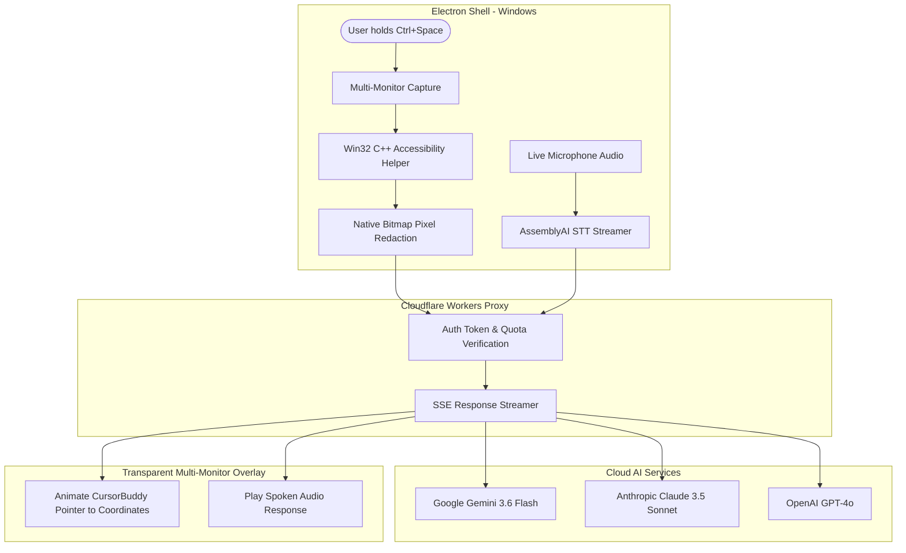

# 🔵 Pip — AI Desktop & Visual Screen Companion

<p align="center">
  
  
  
  
  
</p>

---

## 💡 What is Pip?

**Pip** is a smart, voice-activated AI companion that sits on your computer desktop. When activated via a global push-to-talk shortcut (`Ctrl + Space`), Pip:
1. 📸 **Captures** high-resolution snapshots of your active display(s).
2. 🎙️ **Listens** to your spoken question in real time.
3. 🧠 **Analyzes** your screen context using multimodal AI vision models (Google Gemini, Anthropic Claude, or OpenAI GPT-4o).
4. 🎯 **Visually points out** the exact button, menu, or setting on your actual monitor using an animated pointer (`CursorBuddy`) and glowing element highlight boxes.
5. 🔊 **Speaks** natural audio responses aloud while physically highlighting where to click.

---

## ✨ Key Features

- **🎯 Spatial Visual Screen Pointing (`CursorBuddy`)**
  - Parses spatial coordinate tags (`[POINT:x,y:label]`) from streaming AI vision responses.
  - Animates a glowing pointer sphere with physics-dampened movement and eye-tracking pupil animations directly over target desktop controls.
  - Draws glowing target bounding boxes around buttons, drop-downs, and menu items across single and multi-monitor setups.

- **🎙️ Zero-Friction Push-to-Talk Voice Companion**
  - Hold `Ctrl + Space` anywhere in Windows to activate Pip without losing window focus.
  - Live audio waveform visualizers display mic levels during speech input.

- **🔒 Native Privacy Masking & Password Protection**
  - Queries Windows UIAutomation (UIA) COM APIs to identify password inputs and protected fields across native apps and browsers.
  - Applies black rectangle pixel redaction directly onto bitmap screenshot buffers *before* data is encoded or transmitted to cloud providers.

- **🌐 Edge Key Isolation Proxy (Cloudflare Workers)**
  - All AI requests route through a Cloudflare Worker proxy, keeping secret API keys isolated on the server side.
  - Enforces spending quotas, token verification, and Server-Sent Events (SSE) response streaming.

- **🧠 Multi-Provider AI & Speech Architecture**
  - **Vision Engine**: Google Gemini 3.6 Flash (default fallback), Anthropic Claude 3.5 Sonnet, OpenAI GPT-4o.
  - **Speech-to-Text (STT)**: Real-time AssemblyAI WebSockets audio streaming.
  - **Text-to-Speech (TTS)**: ElevenLabs, OpenAI TTS, and native browser `SpeechSynthesis`.

- **📋 Automatic Session Journaling & Tutorial Export**
  - Logs step-by-step user interactions and AI visual guidance during a session.
  - Exports clean, shareable Markdown tutorial guides complete with goals, timestamps, and action steps.

---

## 🏗️ Architecture Overview



---

## 📁 Repository Structure

```text
pip/
├── native/
│   └── accessibility-win/     # Isolated Win32 C++ UIAutomation COM helper
├── src/
│   ├── main/                  # Electron main process (Orchestration, IPC, Privacy, Hotkeys)
│   │   ├── actions/           # Action policy & permission verification
│   │   ├── accessibility/     # C++ stdio IPC accessibility adapter
│   │   ├── ai/                # AI provider contracts & streaming prompt builders
│   │   ├── audio/             # AssemblyAI STT & ElevenLabs / Web Audio TTS
│   │   ├── ipc/               # Secure IPC channel registry & authorization
│   │   └── privacy/           # Base64 bitmap pixel masking & screenshot policy
│   ├── preload/               # Secure contextBridge bindings for Renderer
│   ├── renderer/              # React 19 UI panels and transparent overlay windows
│   │   ├── panel/             # Settings drawer, onboarding wizard, session controls
│   │   ├── overlay/           # CursorBuddy, BoundingBox highlight layer, speech bubbles
│   │   └── media/             # Visual audio waveform & processing indicators
│   └── shared/                # Types, settings schema, capabilities, IPC constants
├── worker/                    # Cloudflare Worker proxy (Auth, Quota enforcement, SSE streaming)
├── docs/                      # Technical specifications, ADRs, and verification matrices
└── electron-builder.yml       # NSIS Windows installer configuration
```

---

## 🚀 Quick Start & Local Development

### Prerequisites

- **Node.js**: `v18.0.0` or higher
- **Package Manager**: `npm` (v9+)
- **Operating System**: Windows 10/11 (for full Win32 UIAutomation native helper compilation)
- **C++ Build Tools**: Visual Studio Build Tools (C++ workload) or MinGW (for native Win32 helper)

### 1. Clone & Install Dependencies

```bash
# Clone repository
git clone https://github.com/FarhanS7/pip.git
cd pip

# Install dependencies
npm install
```

### 2. Environment Configuration

Create a `.env` file in the root directory for development settings:

```env
# Cloudflare Worker Endpoint
VITE_WORKER_URL=http://127.0.0.1:8787

# Shared API Secret
PIP_SHARED_SECRET=your_development_shared_secret
```

For local Worker testing, set up `worker/.dev.vars`:

```env
PIP_SHARED_SECRET=your_development_shared_secret
GEMINI_API_KEY=your_gemini_api_key
ELEVENLABS_VOICE_ID=kPzsL2i3teMYv0FxEYQ6
```

### 3. Run Development Mode

In separate terminal windows:

```bash
# Terminal 1: Launch Electron App with Vite HMR
npm run dev

# Terminal 2: Launch Cloudflare Worker Proxy locally
cd worker
npx wrangler dev
```

---

## 🧪 Testing & Verification

Pip enforces strict quality gates across linting, static type checking, and unit testing:

```bash
# Code style & ESLint validation
npm run lint

# TypeScript static typechecking (App & Worker)
npm run typecheck

# Execute Vitest unit test suite (166+ tests)
npm test

# Run Cloudflare Worker proxy integration tests
npm run test:integration
```

---

## 📦 Building Executable Packages

To compile native binaries and generate an NSIS Windows Installer (`.exe`):

```bash
# Build Electron bundle and native binaries
npm run build

# Generate Windows standalone installer (output in /release)
npm run dist
```

---

## 🔒 Security & Privacy Model

1. **Pixel-Level Bitmap Redaction**: Sensitive fields (passwords, PINs, auth tokens) are blacked out on the raw bitmap prior to JPEG compression and network transport.
2. **Zero Telemetry**: No user analytics, session recordings, or behavioral profiling are collected or sent to remote servers.
3. **Edge Key Isolation**: API keys remain securely stored in Cloudflare Worker secrets and are never exposed to desktop clients.
4. **IPC Channel Validation**: Preload scripts strictly authorize allowed IPC channels (`security.ts`) to prevent unprivileged renderer code execution.

---

## 📄 License

This repository is licensed under private/proprietary terms. All rights reserved.
